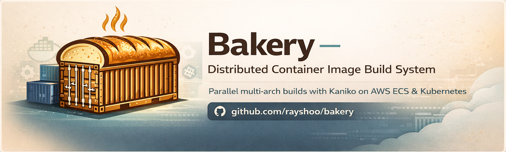

# Bakery

A distributed container image build system powered by Kaniko. Build multi-architecture (amd64, arm64) container images in parallel on AWS ECS or Kubernetes — no Docker daemon required.

Kaniko 기반의 분산 컨테이너 이미지 빌드 시스템으로, Docker 데몬 없이 AWS ECS 또는 Kubernetes에서 멀티 아키텍처(amd64, arm64) 컨테이너 이미지를 병렬로 빌드합니다.

## Documentation

[English](./docs/en.md) | [Korean](./docs/ko.md)