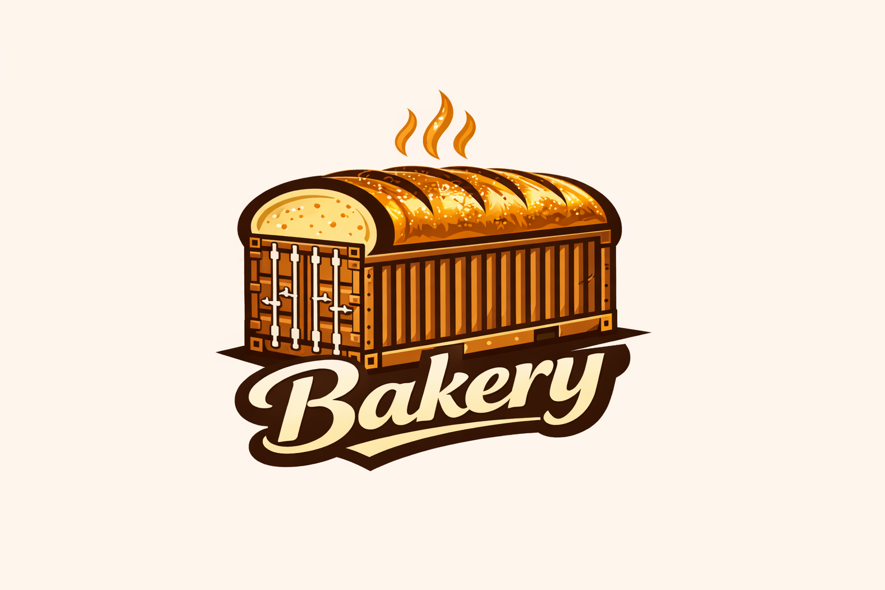

# Bakery

CI/CD에서 멀티 아키텍처(amd64, arm64) 컨테이너 이미지를 빌드할 때, 빌드를 대비한 전용 인스턴스를 상시 유지하는 것은 비효율적입니다. Bakery는 빌드 요청이 들어올 때만 AWS ECS Fargate나 Kubernetes에서 온디맨드로 빌드 컨테이너를 실행하고, 완료 후 자동으로 정리합니다. QEMU 에뮬레이션 없이 각 아키텍처의 네이티브 환경에서 병렬 빌드하여 빠르고, Kaniko 기반이라 Docker 데몬이나 privileged 모드가 필요 없습니다.

A distributed container image build system for multi-architecture (amd64, arm64) builds. Instead of maintaining always-on build instances, Bakery launches build containers on-demand on AWS ECS Fargate or Kubernetes — and cleans them up when done. Builds run natively in parallel on each architecture without QEMU emulation, powered by Kaniko with no Docker daemon or privileged mode required.

## Documentation

[English](./docs/en.md) | [한국어](./docs/ko.md)
